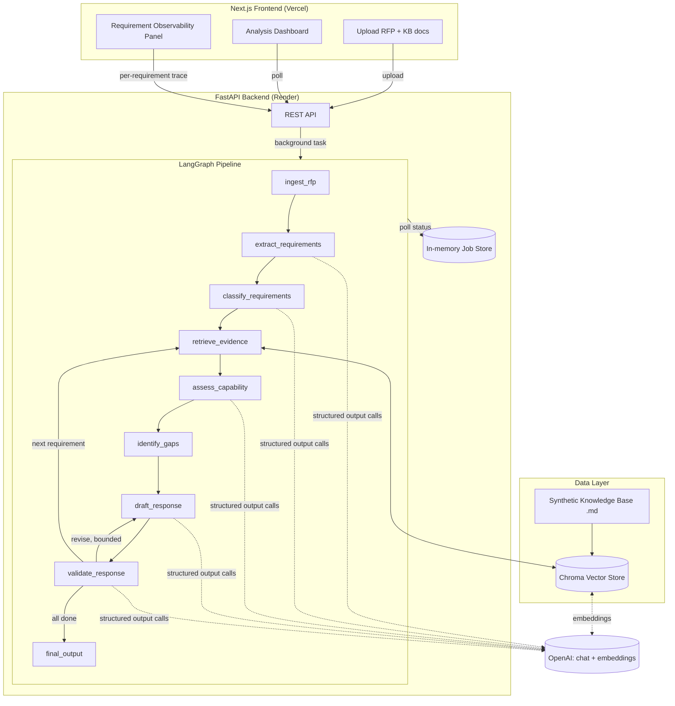

# RFP Analysis & Response Assistant

A portfolio project demonstrating an enterprise GenAI workflow: given an RFP and a company's
capability/reference documents, the system extracts requirements, retrieves grounding evidence,
assesses whether the company can meet each requirement, drafts an evidence-backed response, and
independently validates every draft before it reaches a human — flagging unsupported claims
instead of hallucinating them.

> **This is a portfolio demo.** The company knowledge base (`backend/data/knowledge_base/`) and
> the sample RFP (`backend/data/sample_rfp/`) describe a fictitious company, "NorthPeak Digital
> Partners," and a fictitious RFP issuer, "Meridian Retail Group." No real clients, financials, or
> certifications are represented. The evaluation numbers in this README were computed by actually
> running `eval/run_eval.py` against this synthetic corpus — see [§9](#9-evaluation-methodology).

## 1. Business problem

Responding to an RFP requires a team to read a long, dense document, work out exactly what is
being asked (often 15-50+ discrete requirements bundled into paragraphs), check each one against
scattered internal capability documentation, and write a response that is both persuasive and
*true*. Doing this by hand is slow and inconsistent across writers. Doing it with a single LLM
prompt ("write our RFP response") is fast but produces plausible-sounding, ungrounded text that
overstates capability — exactly the failure mode a real proposal team cannot afford, since an
overstated claim in a submitted RFP response can become a contractual liability.

This project automates the parts of that workflow that are mechanical (parsing, extraction,
retrieval, first-pass classification) while keeping a human in the loop for exactly the
judgment calls that matter: anything flagged `Insufficient Evidence`, `Not Supported`,
`Partially Supported`, or carrying an unsupported claim is surfaced, not buried.

## 2. Solution

A FastAPI backend runs a [LangGraph](https://github.com/langchain-ai/langgraph)-orchestrated
pipeline: ingest → extract requirements → classify → (per requirement) retrieve evidence → assess
capability → identify gaps → draft response → validate → revise-if-needed → final output. A
Next.js frontend lets a user upload reference documents and an RFP, watch the pipeline run
requirement-by-requirement, and drill into any requirement to see exactly what evidence was
retrieved, what was assessed, what was drafted, and why the validator did or didn't ask for a
revision.

## 3. Architecture



**Deployment split**: the backend runs on Render (a long-running Python process is a better fit
for a multi-minute, multi-LLM-call background job and a locally persisted Chroma store than
Vercel's serverless functions), and the frontend runs on Vercel. This mirrors a common real-world
pattern of separating a stateful AI backend from a stateless Next.js frontend.

## 4. Why RAG?

The system must never let the LLM answer "can we do this?" from its own training data — it has no
idea what NorthPeak Digital Partners (or any real company) actually can or can't do. Every
capability claim has to be traceable to a specific sentence in a specific company document. RAG
(retrieve top-k relevant chunks from the knowledge base, then generate *only* from those chunks)
is what makes that traceability possible, and it's what makes the "Insufficient Evidence" status
meaningful: it's not a vibe, it's "the retriever found nothing relevant."

## 5. Why LangGraph?

The workflow is not a single LLM call, and it's not a fixed linear pipeline either — it has a
genuine, bounded control-flow loop (draft → validate → revise) and a per-requirement iteration
that has to fan back out to a shared step (retrieve_evidence) for the next requirement.
LangGraph gives this explicit, inspectable structure:

- Each pipeline stage is a plain Python node function with a single responsibility.
- The revision loop and the requirement-iteration loop are both ordinary conditional edges
  (`route_after_validation` in `backend/app/graph/nodes.py`), not string-matching over an LLM's
  free-text output.
- `graph.stream(..., stream_mode="values")` yields the full state after every node, which is what
  powers the frontend's live progress view and the per-requirement observability drill-down —
  without LangGraph this would need to be hand-built as a custom event bus.
- The state schema (`GraphState` TypedDict) makes every hand-off between nodes explicit and
  type-checked, rather than nodes reaching into a shared mutable blob.

## 6. Where LangChain is used

LangChain components are used only where they remove real, fiddly work — not for their own sake:

| Component | Used for | File |
|---|---|---|
| `PyPDFLoader` / `Docx2txtLoader` / `TextLoader` | Parsing uploaded PDF/DOCX/TXT/MD into plain text | `backend/app/parsing/document_parser.py` |
| `RecursiveCharacterTextSplitter` | Chunking knowledge-base documents for retrieval | `backend/app/rag/vectorstore.py` |
| `OpenAIEmbeddings` | Embedding chunks and queries | `backend/app/rag/vectorstore.py` |
| `Chroma` | Local vector store with metadata filtering | `backend/app/rag/vectorstore.py` |
| `ChatOpenAI` + `.with_structured_output(...)` | Every LLM call that must return validated Pydantic data (extraction, classification, assessment, drafting, validation) | `backend/app/graph/llm.py`, `nodes.py` |

Everything else — the control flow, the revision loop, the deterministic gap/validation logic —
is plain Python, on purpose (see §12).

## 7. Workflow (node by node)

1. **ingest_rfp** *(deterministic)* — normalizes whitespace on the parsed RFP text.
2. **extract_requirements** *(LLM, structured output, chunked by section)* — splits the RFP on its
   own section headings (Markdown `##` headers, or plain numbered headings as a fallback; a
   fixed-size safety net for anything with no detectable structure — see `split_into_sections` in
   `nodes.py`) and extracts atomic `Requirement` objects per section, then renumbers sequentially.
   One call per section keeps output well under the model's max-tokens ceiling regardless of RFP
   size — the earlier single-call version failed outright on a large real RFP during testing (see
   §13). The prompt is explicit that pure background/narrative sections should yield an *empty*
   list, since per-section framing loses the whole-document context that made that obvious. Section
   calls are independent, so they run concurrently via `.batch()` (`max_concurrency=8`) instead of
   one at a time — on the 8-section sample RFP this cut extraction from ~30-40s to ~5s.
3. **classify_requirements** *(LLM, structured output)* — reviews the *full list at once* to
   apply a consistent category taxonomy (catches the case where two similar requirements would
   otherwise get inconsistent categories from independent single-item classification).
4. **retrieve_evidence** *(embeddings + vector search)* — top-k similarity search against the
   knowledge base for the current requirement.
5. **assess_capability** *(LLM, structured output)* — using only the retrieved evidence, decides
   `Fully Supported` / `Partially Supported` / `Not Supported` / `Insufficient Evidence`. The
   prompt explicitly draws the "can't do it" vs. "documents don't prove it" distinction.
6. **identify_gaps** *(deterministic — no LLM call)* — maps capability_status + mandatory/optional
   to a gap type, severity, and `requires_human_review` flag via plain Python rules.
7. **draft_response** *(LLM, structured output)* — writes a response using only the assessment +
   evidence, citing source documents by name; explicitly told to write "Evidence gap —..." instead
   of inventing support when evidence is thin.
8. **validate_response** *(LLM judgment + deterministic gating)* — an independent LLM call checks
   the draft against the requirement and evidence; `citation_present` is checked deterministically
   against the actual response text (not trusted from the LLM); `revision_required` is computed
   deterministically from thresholds, not asked of the model.
9. **Routing** *(deterministic, `route_after_validation`)* — revise (bounded by `MAX_REVISIONS`,
   default 2), move to the next requirement, or proceed to final_output.
10. **final_output** *(deterministic aggregation + one short LLM narrative)* — computes the
    executive summary statistics, builds the requirement matrix and consolidated response, and
    collects the human-review list.

## 8. Data model

See `backend/app/models/schemas.py` (Pydantic) and `frontend/lib/types.ts` (hand-mirrored
TypeScript). Core types: `Requirement`, `EvidenceChunk`, `CapabilityAssessment`,
`GapAnalysisResult`, `DraftResponse`, `ValidationResult`, `RequirementResult` (the per-requirement
rollup used for observability), and `FinalAnalysis` (the dashboard payload).

## 9. Evaluation methodology

`backend/eval/dataset.py` hand-labels 12 requirement-level cases (clearly supported, partially
supported, unsupported, a case with genuinely insufficient evidence, and one deliberately
ambiguous requirement) plus 2 deliberately flawed drafts (one that contradicts its own cited
evidence, one missing a citation entirely) used to test whether the validator actually catches
problems. `backend/eval/run_eval.py` calls the **same node functions the live app uses** against
this dataset and writes real, computed metrics to `backend/eval/results.json` — nothing here is
hand-typed or estimated. Reproduce with:

```bash
cd backend && source .venv/bin/activate && python -m eval.run_eval
```

**Actual results from the last run** (`gpt-4o-mini`, `text-embedding-3-small`):

| Metric | Result |
|---|---|
| Requirement extraction (sample RFP, 20 hand-counted requirements) | 20/20 extracted, 100% field completeness |
| Retrieval hit-rate (expected source doc in top-4) | 100% (11/11 scored cases) |
| Capability classification accuracy | 72.7% (8/11) |
| Evidence grounding rate (citations ⊆ retrieved sources) | 100% (12/12) |
| Validator recall on deliberately flawed drafts | 100% (2/2) |

The grounding rate is a good example of what this eval harness is actually for: an earlier run
scored 58.3% here, and the failure detail (`eval/results.json` → `evidence_grounding.details`)
showed every failure had `citations: []` — the drafting prompt told the model to state a
capability gap plainly, but never told it to still name which document it *checked* to reach that
conclusion, so "Not Supported"/"Insufficient Evidence" responses routinely shipped with no
citation. That also explains a separate thing noticed during manual testing: gap-finding
requirements tended to burn through all `MAX_REVISIONS` attempts, because a missing citation
always fails `validate_response`'s deterministic `citation_present` check, however good the
response text is. Fixed by making `DRAFT_RESPONSE_SYSTEM` (`backend/app/graph/prompts.py`)
require a "reviewed: `<doc>` — no mention of X" citation for negative findings too, not just
positive ones — grounding went to 100% and gap-finding responses stopped needlessly maxing out
the revision loop.

These numbers can still move a point or two between runs — the chat model is called at
`temperature=0.1`, not `0` — but retrieval hit-rate and validator recall have stayed at 100%
across every run so far. The classification accuracy is the most interesting number, not the
highest: the 3 misses were all the model calling `Not Supported` where the label was
`Insufficient Evidence` (or vice versa) — exactly the boundary the system is designed to draw
carefully (§ "capability assessment" in the original brief). It's a genuine, demonstrable
limitation of a single `gpt-4o-mini` classification pass on subtly-worded evidence, not a bug —
and a good discussion point on how you'd improve it in
production (few-shot examples per category, a second-pass reconciliation prompt, or a larger
model for this specific call).

## 10. How to run locally

### Backend

```bash
cd backend
python3 -m venv .venv && source .venv/bin/activate
pip install -r requirements.txt
cp .env.example .env   # then edit .env and set OPENAI_API_KEY
uvicorn app.main:app --reload --port 8000
```

The knowledge base is seeded automatically from `backend/data/knowledge_base/` on first startup
(persisted to `backend/data/chroma/`, which is git-ignored).

### Frontend

```bash
cd frontend
npm install
cp .env.example .env.local   # NEXT_PUBLIC_API_URL=http://localhost:8000
npm run dev
```

Open `http://localhost:3000`, optionally add reference documents, then upload
`backend/data/sample_rfp/sample_rfp.md` (or your own RFP) and click **Start analysis**.

### Tests

```bash
cd backend && source .venv/bin/activate && python -m pytest -q
cd frontend && npx tsc --noEmit && npx next lint
```

## 11. Environment variables

**backend/.env** (see `backend/.env.example`):

| Variable | Purpose |
|---|---|
| `OPENAI_API_KEY` | Required. Never commit this file. |
| `OPENAI_CHAT_MODEL` | Default `gpt-4o-mini` |
| `OPENAI_EMBEDDING_MODEL` | Default `text-embedding-3-small` |
| `CORS_ORIGINS` | Comma-separated list of allowed frontend origins |
| `MAX_REVISIONS` | Cap on the draft→validate revision loop (default 2) |
| `RETRIEVAL_TOP_K` | Chunks retrieved per requirement (default 4) |

**frontend/.env.local** (see `frontend/.env.example`):

| Variable | Purpose |
|---|---|
| `NEXT_PUBLIC_API_URL` | Base URL of the backend API |

## 12. What's deterministic vs. what uses an LLM

This is a common interview question for this project, so it's spelled out explicitly:

**Deterministic (plain Python, no LLM call):** `ingest_rfp`'s text cleanup; `identify_gaps` in
full (gap type / severity / human-review flag are rule-based on capability_status +
mandatory/optional); the `citation_present` check inside `validate_response` (string match against
the actual response text, not the model's self-report); the `revision_required` gate (threshold
logic over the LLM's sub-judgments, not asked of the model directly); the routing between
revise/next-requirement/done; and all of `final_output`'s statistics, matrix, and human-review-list
aggregation.

**LLM (structured output):** requirement extraction, requirement classification, capability
assessment, response drafting, and the validator's judgment fields (`requirement_addressed`,
`evidence_supported`, `unsupported_claims`, `missing_elements`, `validation_score`). Plus one
short free-text LLM call for the executive summary narrative in `final_output`.

**Embeddings (not "an LLM call" in the generative sense):** knowledge-base indexing and
requirement-evidence retrieval.

## 13. Limitations

- **In-memory job store.** Jobs (`backend/app/storage/jobs.py`) live in a single process and are
  lost on restart. A real deployment would persist jobs (and the vector store) in Postgres/pgvector
  so multiple backend instances could share state.
- **Single-writer Chroma store.** Fine for a demo; a production system with concurrent uploads
  across instances would want pgvector or a managed vector DB.
- **No auth.** Anyone who can reach the API can upload documents and run analyses. Would need to
  be added before any real deployment beyond a personal demo.
- **Capability classification accuracy is ~73% on the eval set** (§9) — the `Not Supported` vs.
  `Insufficient Evidence` boundary is genuinely hard for a single `gpt-4o-mini` pass on subtly
  worded evidence.
- **RFP size, partially mitigated.** `extract_requirements` chunks the RFP by section (§7) instead
  of sending it in one call, which is what fixes the large-RFP failure mode this project actually
  hit in testing (a single call's output got truncated past the model's max-tokens ceiling on a
  ~23k-token real RFP). What's still unhandled: a single *section* with an unusually dense run of
  requirements and no sub-headings could itself exceed the per-call output ceiling — the fixed-size
  safety-net splitter bounds input size, not the number of requirements a section could produce.
- **English only**, by construction of the demo knowledge base and prompts.

## 14. Future improvements

- Swap the in-memory job store and Chroma for Postgres + pgvector, so state survives restarts and
  scales across instances.
- Add a second-pass reconciliation LLM call specifically for the `Not Supported` vs.
  `Insufficient Evidence` boundary that §9 shows is the main source of classification error.
- Extend `split_into_sections` to also bound requirement *density* within a section (not just
  section character length), for the edge case noted in §13.
- Authentication + per-user knowledge bases, for a real multi-tenant proposal team.
- Swap `langchain-community` document loaders for the standalone integration packages it's being
  split into (it currently emits a deprecation warning — functional today, but worth tracking).
- Generate `frontend/lib/types.ts` from the backend's OpenAPI schema instead of hand-mirroring it.

---

## Interview crib sheet

- **Why is this an AI application and not "a RAG chatbot"?** A chatbot answers one question per
  turn from retrieved context. This system runs a *multi-stage pipeline with state, branching,
  and a bounded self-correction loop* across potentially dozens of requirements per run, and
  produces structured, machine-checkable output (not just chat text) at every stage.
- **What does each node do?** §7, above — and it's worth pointing at `backend/app/graph/nodes.py`
  directly, since every node is a short, single-purpose function.
- **How does it handle hallucination?** Three layers: (1) retrieval constrains generation to
  actual document content, (2) the drafting prompt is explicitly told to say "evidence gap" rather
  than invent support, (3) an independent validator checks the draft against the evidence and
  triggers a bounded revision loop — plus a deterministic citation check that doesn't trust the
  model's own claim that it cited something.
- **How is evidence retrieved?** OpenAI embeddings + Chroma similarity search, top-k=4 by default,
  queried per-requirement using the requirement text + requested capability + evidence-needed
  fields together.
- **How are capability gaps identified?** Deterministically, in `identify_gaps`, from the
  capability_status the assessment node already produced — see §12.
- **How does the validation/revision loop work?** §7 step 8-9; bounded by `MAX_REVISIONS`.
- **How would this adapt for a real consulting proposal team?** Swap the demo knowledge base for
  the firm's real capability library (with proper access control), add authentication and
  per-engagement workspaces, persist jobs/vectors in Postgres+pgvector, and put a human
  sign-off step before any response is considered final — this system is designed to produce a
  reviewable first draft, not a submission-ready document.
- **What's deterministic vs. LLM-driven?** §12.
- **How would you evaluate this in production?** Keep the same structure as §9 (hand-labeled
  cases run against the live nodes) but grow the dataset, add inter-rater-checked labels, and
  track the metrics over time as prompts/models change — a regression suite, not a one-off report.
